    
# ProbSol

It is a knowledge-sharing Android application that can be used by anyone who has doubts about something. If you have any doubt about anything, you can find the expertise people of that particular field, who are eager to share their knowledge to solve your problem. One can sign in as expertise and earn money as well. The technologies that I used in this project are Android Studio (IDE), Java for backend, XML for UI, and for database, I used google's Firebase. 

## Demo

gif Coming Soon

  
## Tech Stack

**IDE:** Android Studio

**Languges Used:** Java,XML

**Database:** Firebase

## APK
  [Download APK](https://github.com/sanskarpawar/ProbSol_Firebase/blob/master/Screenshots/ProbSol.apk)
#### Some Screenshots of this app

 Login                               | SignUp                                        | Mobile Login 			                    | Reset Password 
:------------------------------------------:|:-------------------------------------------:|:-----------------------------------------------:|:----------------------------------------:
 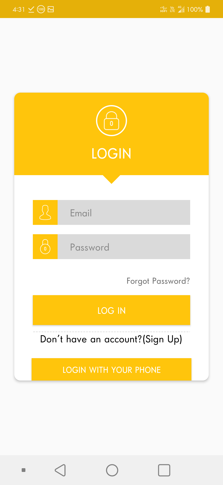 |   |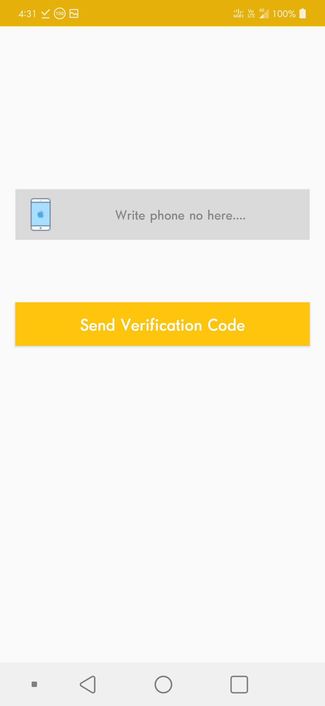|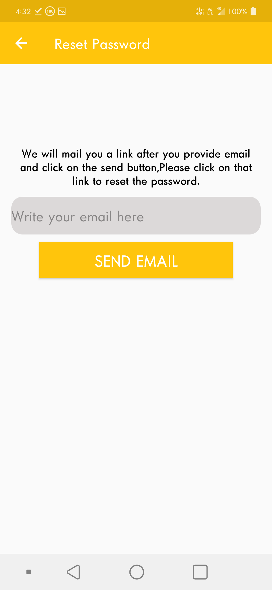

 Talks Tab                           | Chat                             | Notes Tab                       | Contacts Tab
:-----------------------------------------:|:--------------------------------------------:|:-----------------------------------------------:|:-------------------------------------:
 | |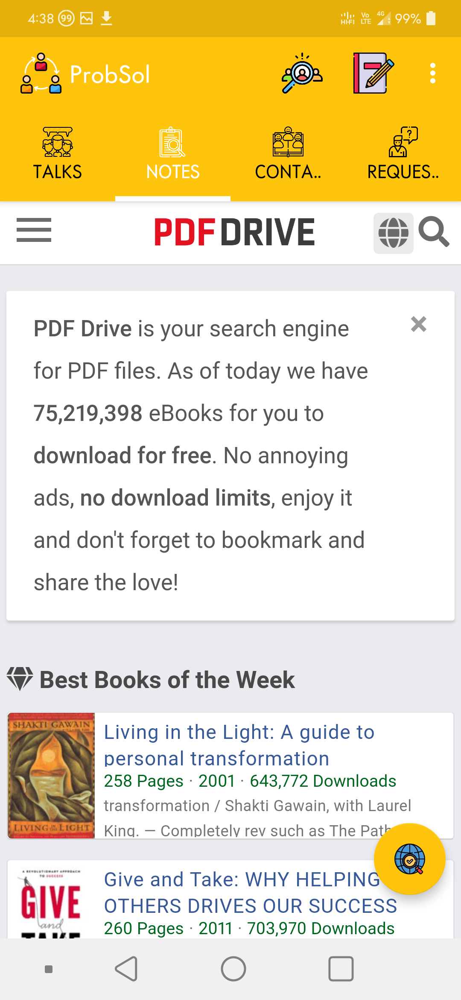|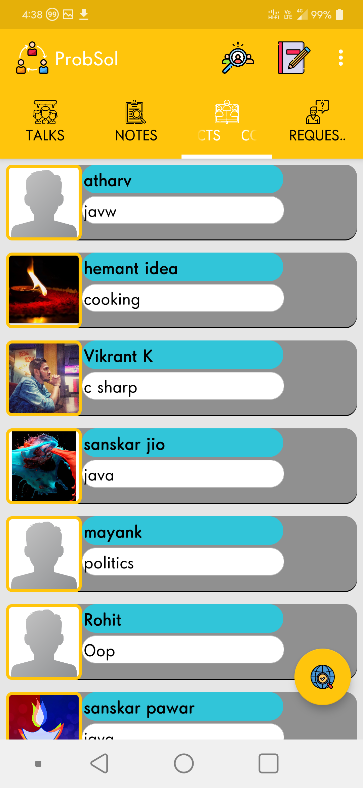
 
 Profile                           | Requests                             | Menu                       | Find By Field
:-----------------------------------------:|:--------------------------------------------:|:-----------------------------------------------:|:-------------------------------------:
 | 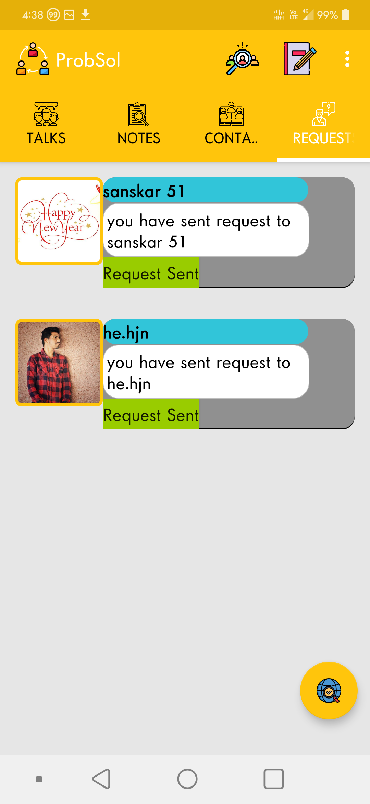|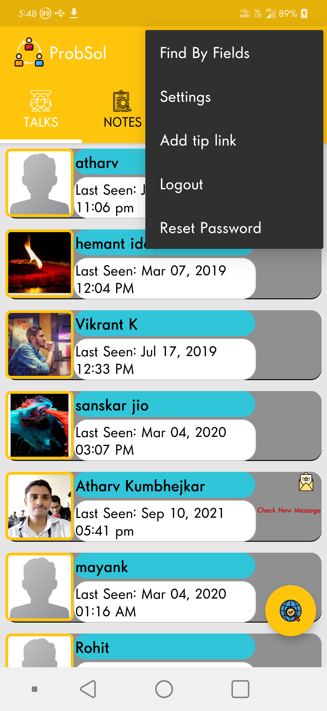|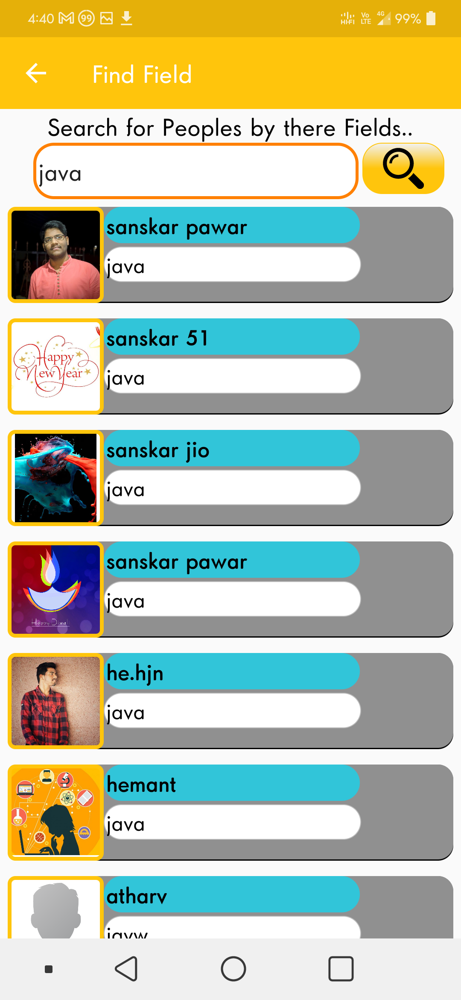
 
 Setting                           | Update Image                             | Add Tip Link                       | Add Notes
:-----------------------------------------:|:--------------------------------------------:|:-----------------------------------------------:|:-------------------------------------:
 | |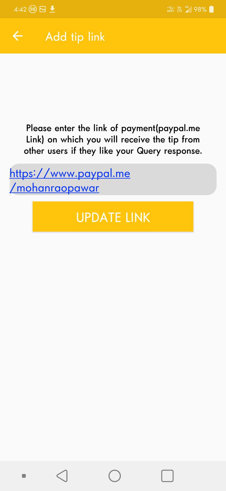|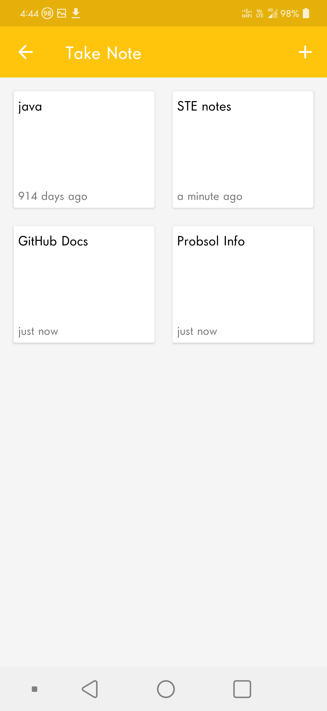
 
 
Edit Note                          | 
:-----------------------------------------:|
 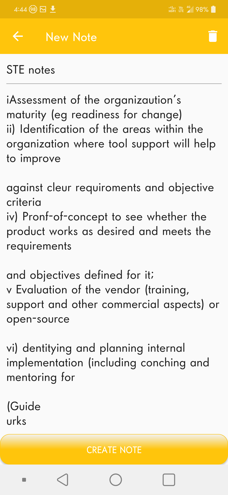| 
 
 
## License

[MIT](https://choosealicense.com/licenses/mit/)

## Support

For support, email pawarsanskar50@gmail.com 
 
 
 
 
 
 
 
 
 
 
 
 
 
 
 
 
